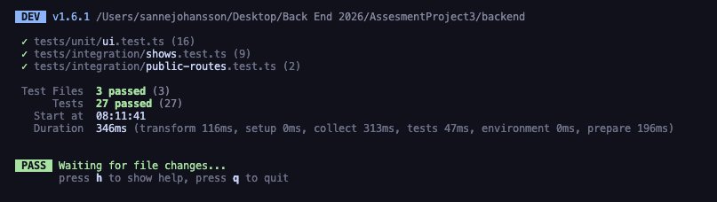
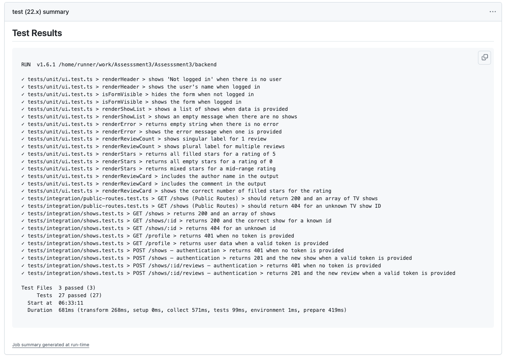

# Review Room - TV Show Review API

Review Room is a TV show review API and frontend built for a testing and authentication assignment. The project focuses on clean route design, Firebase authentication, unit tests, integration tests, and a simple CI pipeline.

## Overview

The backend is built with Express, TypeScript, and Firebase Admin SDK. The frontend is a small vanilla JavaScript app that signs users in with Firebase Auth, fetches public show data, and sends authenticated requests with Bearer tokens.

The API exposes these routes:

- `GET /shows` - public
- `GET /shows/:id` - public
- `GET /profile` - protected
- `POST /shows` - protected
- `POST /shows/:id/reviews` - protected

## Setup

### 1. Clone the repository

```bash
git clone https://github.com/ssannejohansson/Assesssment3.git
cd Assesssment3
```

### 2. Install dependencies

Install the backend dependencies:

```bash
cd backend
npm install
```

Install the frontend dependencies:

```bash
cd ../frontend
npm install
```

### 3. Configure environment variables

Use the example files as a template:

- `backend/.env.example`
- `frontend/.env.example`

For the backend, make sure the following values are configured:

- `PORT=3001`
- `CORS_ORIGIN=http://localhost:5500`
- `FIREBASE_PROJECT_ID`
- `FIREBASE_PRIVATE_KEY`
- `FIREBASE_CLIENT_EMAIL`

For the frontend, the Firebase web config is defined in `frontend/src/firebase-config.js`. The values shown there are the public Firebase project settings used by the browser app.

### 4. Run the project locally

Start the backend:

```bash
cd backend
npm run dev
```

Start the frontend in another terminal:

```bash
cd frontend
npx serve src -l 5500
```

Then open the frontend in your browser and use the login form to authenticate.

## Testing

### Run tests locally

Run the backend test suite:

```bash
cd backend
npm test
```

Run the backend build check:

```bash
npm run build
```

Run the frontend unit tests:

```bash
cd ../frontend
npm test
```

### Screenshots

**Passing tests locally**



**Screenshot 2 — Passing GitHub Actions pipeline**

Go to your GitHub repo → Actions tab → click the latest run → take a screenshot of the green checkmark summary. Paste it here:



## Authentication

This project uses Firebase authentication.

- The frontend signs users in with Firebase Auth.
- After login, the frontend requests an ID token from Firebase.
- Protected requests send that token in the `Authorization: Bearer <token>` header.
- The backend uses Firebase Admin SDK and the `verifyToken` middleware to validate the token.
- Protected routes return `401 Unauthorized` when the token is missing or invalid.

Firebase was chosen because it gives a clear token-based flow between browser and server, which makes the authentication logic easy to test and explain.

## Security Decisions

The project follows the security checklist from the assignment:

- No secrets are committed to the repository. Sensitive backend values belong in `backend/.env`, and the example file shows what is needed.
- The frontend Firebase web config is public client configuration, not a private secret. The sensitive Firebase Admin values stay on the backend.
- CORS is restricted to the frontend origin instead of using `*`. This prevents random websites from making cross-origin requests to the API during development.
- Tokens are not stored in `localStorage`. The app relies on Firebase Auth state and requests fresh ID tokens when needed, which avoids long-lived browser storage for auth tokens.
- Authenticated requests use the `Authorization: Bearer <token>` header so the backend can verify the caller before allowing protected actions.
- All frontend fetch calls include `credentials: "include"`, which is the equivalent of `withCredentials: true`. This ensures cookies and credentials are sent with cross-origin requests, which is required for CORS to work correctly with authenticated sessions.
- The Firebase service account private values are kept out of source control and handled through environment variables or GitHub Secrets.

Why these choices matter:

- They keep the auth flow explicit and easy to test.
- They reduce the chance of leaking credentials in the repo.
- They keep the frontend and backend loosely coupled, which is useful for testing and CI.

## Reflections

Implementation choices:

- An in-memory data store was used so the assignment stays focused on routing, testing, and authentication instead of database setup.
- The backend uses small route handlers and straightforward validation so the tests can target behavior directly.
- The frontend stays intentionally simple: login, logout, public show browsing, and protected create/review actions.

What was challenging:

- Route ordering in Express matters. Static routes like `/profile` must be placed carefully so they are not shadowed by dynamic routes like `/:id`.
- Keeping the frontend and backend auth flow aligned required consistent handling of Firebase state and Bearer tokens.
- The biggest tradeoff was balancing simplicity for the assignment with enough structure to keep the code readable and testable.

What would I do differently:

- I would add input validation on the backend (e.g. reject reviews with a rating outside 1–5, or shows missing required fields) to make the API more robust.
- I would extract the in-memory data store behind a proper repository interface so it could be swapped for a real database without touching the controllers.
- I would add more granular error handling on the frontend so each view shows its own error message rather than sharing a single error element.

This is a solo project.

## Project Status

The repository includes:

- Backend integration tests for public and protected routes
- Frontend unit tests for UI logic
- A GitHub Actions workflow for automated test runs


